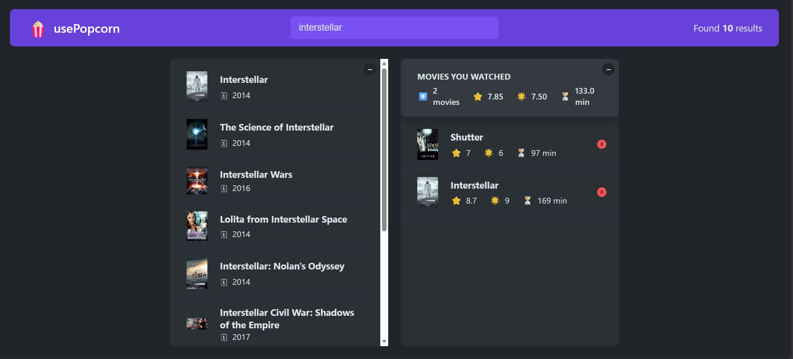

# 🎬 usePopcorn – Movie Search & Watchlist App

A React application that allows users to search for movies, view details, and manage a personal watched list.

## 🚀 Features

- 🔍 Search movies using external API
- 🎥 View movie details and ratings
- ⭐ Add movies to watched list
- 💾 Persist data using localStorage
- ⌨️ Keyboard interactions (Escape, Enter)
- ⚡ Optimized with custom React hooks

## 🛠️ Built With

- React (Create React App)
- JavaScript (ES6+)
- CSS

## 🧠 Key Concepts Practiced

- Custom Hooks (`useMovies`, `useLocalStorage`, `useKey`)
- API Fetching & Async Logic
- State Management
- useEffect Cleanup (AbortController, Event Listeners)
- useRef for DOM manipulation

## 📸 Screenshots

## 🔗 Live Demo

Coming soon ...

## 📂 Project Structure

- Components-based architecture
- Reusable hooks
- Clean and modular code

## 📌 What I Learned

- Writing reusable logic using custom hooks
- Handling side effects properly
- Improving UX with keyboard interactions
- Structuring real-world React applications

---

👨‍💻 Developed by Muhammed Hamido
